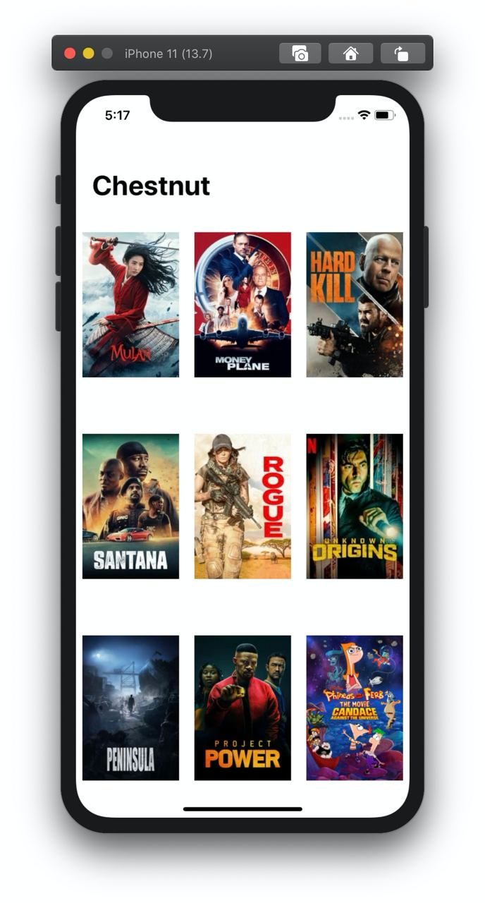

# Chestnut
> A small app for viewing info about popular movies from TMDB.

    

## Features ✨

- [x] Fetching movies from TMDB API
- [x] Viewing info about selected movie

## TODO 🛠

- [ ] Favorites
- [ ] Auth
- [ ] Tests
- [ ] More ideas here...

## Screenshots 📱

<table>
<td>

</td>
</table>

## Requirements 🏗

- iOS 12+
- Xcode 11+